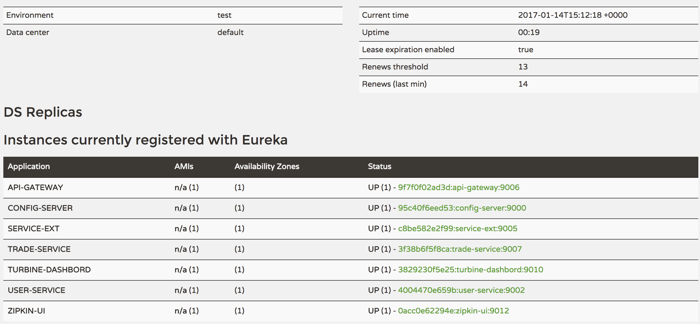
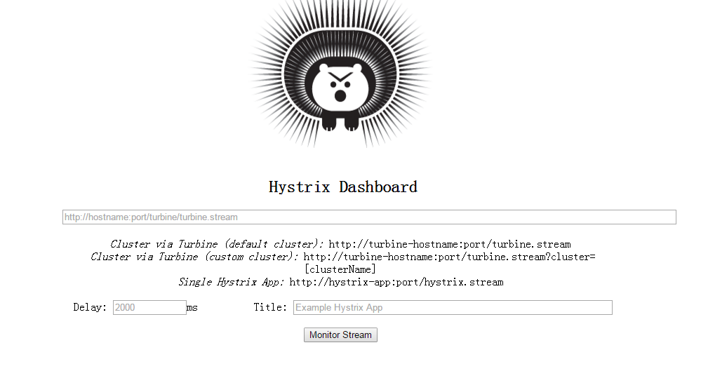
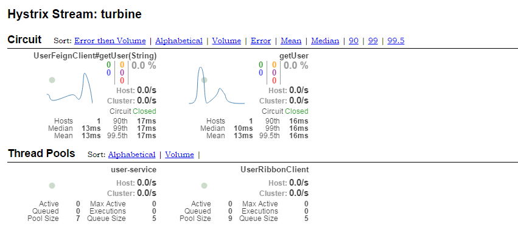

# spring-cloud-example
## Quick Start
### Requirements
The requirements for running this example on your machine are found below.
* Maven 3
* Java 8
* Docker 1.10.3
* Docker Compose 1.9

### Clone and Build

```bash
git clone https://github.com/ThoreauZZ/spring-cloud-example.git
cd spring-cloud-example
mvn install
```
wait for a period of time。


### Start 
```
docker-compose up
```

### Test And Verify:
1. Config : [http://localhost:9000/user-service/dev](http://localhost:9000/user-service/dev)
2. Eureka-dashbord : [http://localhost:9001/](http://localhost:9001/)


3. Turbine-dashbord : [http://localhost:9010/hystrix](http://localhost:9010/hystrix)


Paste url[http://localhost:9010/turbine.stream](http://localhost:9010/turbine.stream) in Hystrix Dashboard, and moniter stream.



4. Zull-->user: [http://localhost:9006/user/user?id=1&token=anything](http://localhost:9006/user/user?id=1&token=anything)

5. user-clint-->user: [http://10.69.42.86:9005/user/ribbon?id=1](http://10.69.42.86:9005/user/ribbon?id=1)
   user-clint-->user: [http://10.69.42.86:9005/user/feign?id=1](http://10.69.42.86:9005/user/feign?id=1)