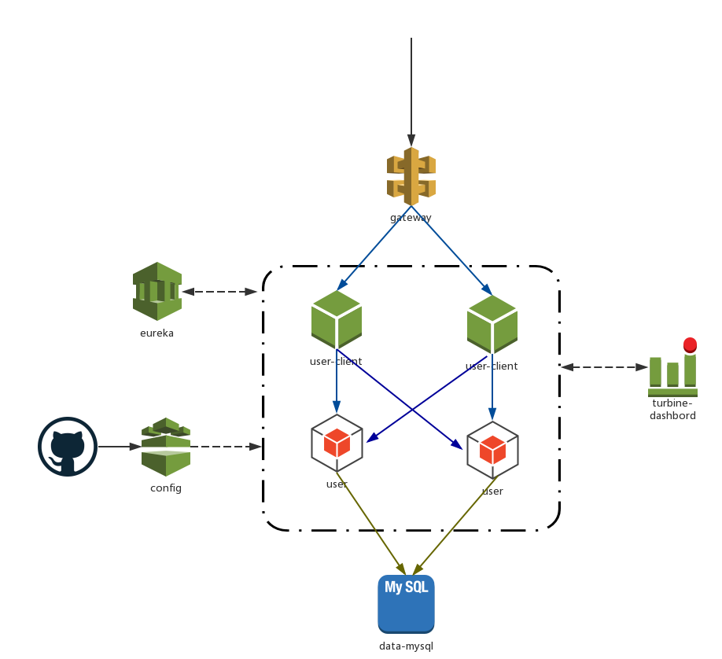

# spring-cloud-example
---
English | [中文](doc/README-CN.md)
## Quick Start
### Requirements
The requirements for running this example on your machine are found below.
* Maven 3
* Java 8
* Docker 1.10.3
* Docker Compose 1.9

### Clone and Build

```bash
git clone https://github.com/ThoreauZZ/spring-cloud-example.git
cd spring-cloud-example
mvn clean package -Pdocker
```
wait for a period of time。


### Start 
```
HOST_IP=192.168.99.100 docker-compose up -d
```
> Discovery and config shuld be started before all services.
>   Controlling startup order in `Docker Compose`:[https://docs.docker.com/compose/startup-order/](https://docs.docker.com/compose/startup-order/)
> 
> We usr docker-compose file version 2.1 healthcheck

* HOST_IP : docker host ip 


### Test And Verify:
 
 Click [here](doc/1.Test And Verify.md) for details


## Architecture

