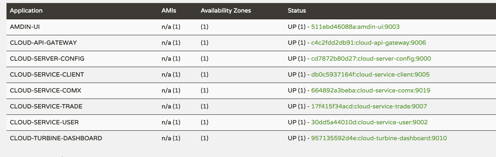

# spring-cloud-example
---
English | [中文WIKI](doc/README-CN.md) 


## Technologies
Spring Cloud: Dalston SR1
* spring cloud config 
* Spring Cloud Netflix: Eureka Zuul Ribbon Feign
* Spring Cloud Bus
* Spring Cloud Sleuth + Zipkin + Mysql

Maven Plugin
* git-commit-id-plugin
* docker-maven-plugin
* maven-resources-plugin

Orthers
* swagger
* rabbitmq 
* mybatis


## Quick Start
### Requirements
The requirements for running this example on your machine are found below.
* Maven 3.5.0
* Java 8
* Docker 1.13.1
* Docker Compose 1.10.0

### Clone and Build

```bash
git clone https://github.com/ThoreauZZ/spring-cloud-example.git
cd spring-cloud-example
mvn clean package -Pdocker -Dmaven.test.skip=true
```
wait for a period of time。


### Start 
```
docker-compose up -d
```
> Discovery and config shuld be started before all services.
>   Controlling startup order in `Docker Compose`:[https://docs.docker.com/compose/startup-order/](https://docs.docker.com/compose/startup-order/)


> Here user docker-compose file version 2.1 `healthcheck`


 
### Test And Verify
#### 1. Config : [http://localhost:9000/cloud-service-user/dev](http://localhost:9000/cloud-service-user/dev)
```bash
curl -s  http://localhost:9000/cloud-service-user-dev.json | jq .
curl -s  http://localhost:9000/cloud-service-user/dev | jq .
curl -s  http://localhost:9000/cloud-service-user-dev.yaml
curl -s  http://localhost:9000/cloud-service-user-dev.properties
```
```json
{
  "name": "cloud-service-user",
  "profiles": [
    "docker"
  ],
  "label": "master",
  "version": "7969ae23baf289f5a4ab56759bdb9c41be3c0e88",
  "state": null,
  "propertySources": [
    {
      "name": "https://github.com/ThoreauZZ/spring-cloud-example.git/config-repo/cloud-service-user-docker.properties",
      "source": {
        "spring.datasource.driver-class-name": "com.mysql.jdbc.Driver",
        "spring.datasource.username": "root",
        "spring.datasource.password": "1234",
        "spring.datasource.url": "jdbc:mysql://db:3306/springcloud?useUnicode=true&characterEncoding=UTF-8",
        "spring.datasource.type": "com.alibaba.druid.pool.DruidDataSource"
      }
    },
    {
      "name": "https://github.com/ThoreauZZ/spring-cloud-example.git/config-repo/application-docker.properties",
      "source": {
        "spring.rabbitmq.password": "guest",
        "spring.rabbitmq.port": "5672",
        "spring.rabbitmq.host": "rabbitmq",
        "spring.rabbitmq.virtualHost": "/",
        "spring.rabbitmq.username": "guest",
        "spring.sleuth.sampler.percentage": "1.0",
        "logging.level.org,springframework.cloud.sleuth": "DEBUG"
      }
    }
  ]
}
```
#### 2. Eureka-dashboard : [http://localhost:9001/](http://localhost:9001/)




```bash
$curl -s -H "Accept:application/json" http://localhost:9001/eureka/apps | jq '.applications.application[] | {service: .name, ip: .instance[].ipAddr, prot: .instance[].port."$"}'
```

```json
{
  "service": "CLOUD-SERVICE-CLIENT",
  "ip": "172.19.0.9",
  "prot": 9005
}
{
  "service": "CLOUD-SERVER-CONFIG",
  "ip": "172.19.0.6",
  "prot": 9000
}
{
  "service": "CLOUD-SERVICE-USER",
  "ip": "172.19.0.8",
  "prot": 9002
}
{
  "service": "AMDIN-UI",
  "ip": "172.19.0.12",
  "prot": 9003
}
{
  "service": "CLOUD-SERVICE-TRADE",
  "ip": "172.19.0.5",
  "prot": 9007
}
{
  "service": "CLOUD-SERVICE-COMX",
  "ip": "172.19.0.7",
  "prot": 9019
}
{
  "service": "CLOUD-TURBINE-DASHBOARD",
  "ip": "172.19.0.10",
  "prot": 9010
}
{
  "service": "CLOUD-API-GATEWAY",
  "ip": "172.19.0.11",
  "prot": 9006
}
```
#### 3. Turbine-dashboard : [http://localhost:9010/hystrix](http://localhost:9010/hystrix)


Paste url [http://localhost:9010/turbine.stream](http://localhost:9010/turbine.stream) in Hystrix Dashboard, and moniter stream.


#### 4. Zipkin UI

   http://localhost:9012   
   
   

#### 5. service api

gateway-->user
```
$ curl -s http://localhost:9006/user/personalInfo?id=2 | jq .
{
  "message": "",
  "data": {
    "id": 2,
    "loginName": "henry",
    "nickName": "henry",
    "password": "1234",
    "mobile": "12345678901",
    "email": "12345678909",
    "gender": 1,
    "registerTime": 2017
  }
}
```

```
$ curl -s http://localhost:9006/user/personalInfo?id=3 | jq .
{
  "message": "user not found",
  "data": {}
}
HTTP/1.1 404
X-Application-Context: cloud-api-gateway:docker:9006
Date: Sat, 18 Feb 2017 06:28:33 GMT
Content-Type: application/json;charset=UTF-8
Transfer-Encoding: chunked
Connection: close
```

gateway --> trade
```
$ curl -s 127.0.0.1:9006/trade/order?id=1 | jq .
{
  "message": "",
  "data": {
    "id": 1,
    "price": 12.123,
    "customerId": 1,
    "itemId": null,
    "sellerId": 2
  }
}
```
feign -> user 
```bash
curl -s 'http://192.168.99.100:9005/client/feign?id=1' |jq .
{
  "id": 1,
  "loginName": "erdaoya",
  "nickName": "erdaoya",
  "password": "1234",
  "mobile": "12345678909",
  "email": "xx@gmail.com",
  "gender": 0,
  "registerTime": 2017
}
```
ribbon -> trade
```bash
$ curl -s 'http://192.168.99.100:9005/client/trade/order?id=1' |jq .
{
  "id": 1,
  "price": 12.123,
  "customerId": 1,
  "itemId": null,
  "sellerId": 2
}
```


If you want the api include seller details(assume that sellerId is associated with userId)， But do not want call user from trade。

`cloud-service-comx` will help you.

json config: `api/ext/trade/order/get.json`
```json
{
  "meta": {
    "module": "order",
    "name": "order detail ext",
    "memo": "get full orderDetail",
    "uri": {
      "parameters": [
        {
          "field": "id",
          "name": "order id",
          "type": "long",
          "memo": "must"
        }
      ]
    }
  },
  "decors": [
    {
      "source": {
        "base":"springcloud",
        "uri":"http://cloud-service-trade/trade/order?id={request.url.query.id}"
      },
      "decors": [
        {
          "field": "seller",
          "source": {
            "base":"springcloud",
            "uri": "http://cloud-service-user/user/personalInfo?id={ref.sellerId}",
            "onError": {
              "type": "ignore"
            }
          }
        }
      ]
    }
  ]
}
```
gateway --> cloud-service-comx :
```
$ curl -s 127.0.0.1:9006/ext/trade/order?id=1 | jq .
  {
    "message": "",
    "data": {
      "seller": {
        "id": 2,
        "loginName": "henry",
        "nickName": "henry",
        "password": "1234",
        "mobile": "12345678901",
        "email": "12345678909",
        "gender": 1,
        "registerTime": 2017
      },
      "sellerId": 2,
      "price": 12.123,
      "customerId": 1,
      "id": 1
    }
  }
```


#### 6. Admin
   
   [http://localhost:9003/](http://localhost:9003/)
   
   
   


## Architecture


## High availability
[eureka-cluster](doc/eureka-cluster.md)
